# Layer 4 Load balancing using mysql flask and nginx

This project is a demonstration of using nginx as a layer 4 load balancer for a python based web app and mysql. This project is created using docker compose. 

There are 3 folders `mysql`, `python-webserver` and `nginx-load-balancer` that contains the necessary compose files. We'll see details of these files later on.

## Steps 

- Create 3 vpc
- Create vpc peering between 
    - VPC Nginx and VPC Webapp
    - VPC Nginx and VPC Database
- Create 1 vm instance in each vpc
- Create firewall rules for each instance 
- Install necessary packages in each instance
- Clone this repository in all 3 instances 
- Run `mysql`, `python-webserver` and `nginx-load-balancer` in each instance using `docker-compose`
- Test the setup

## Component Diagram

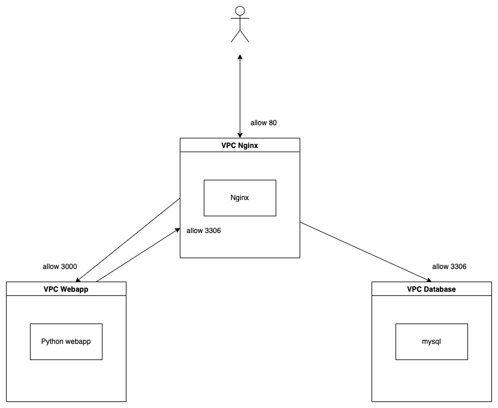

### Create 3 VPCs

1. After logging in to Google Cloud console go to `VPC network > VPC Network`

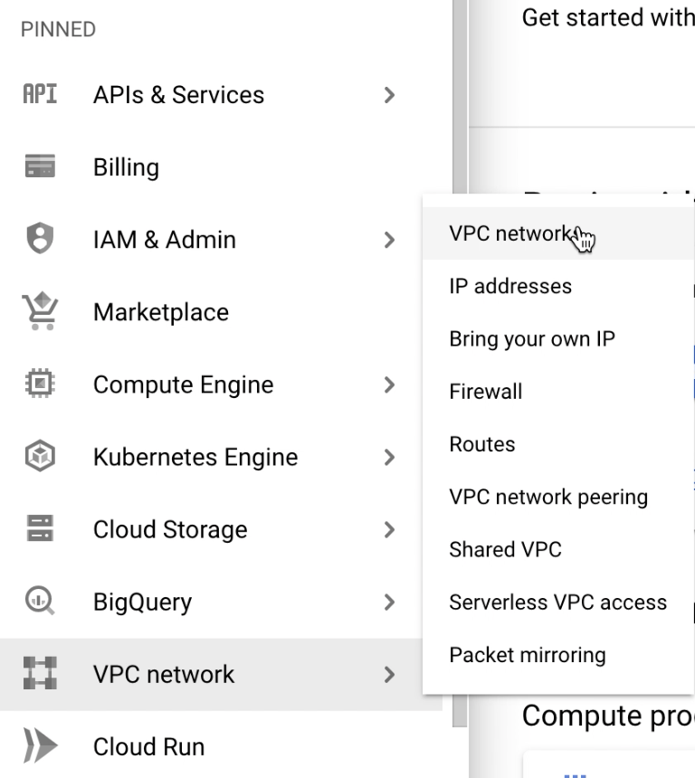

2. Then click on `CREATE VPC NETWORK` button

3. In the create vpc form give it a name (eg: `vpc-nginx-lb`), give a subnet name(eg: `subnet-1`), select a region(eg: `us-east1`) and give an ip address range(eg: `10.0.0.0/16`)

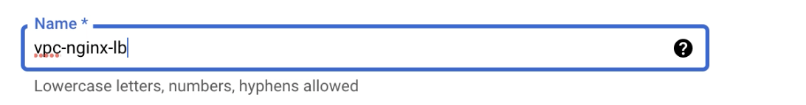
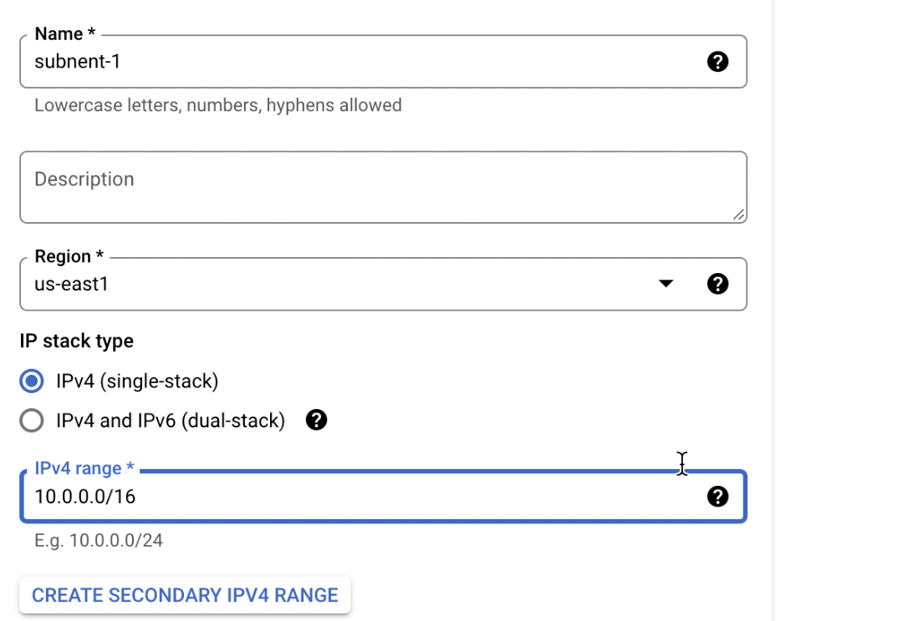

4. Now sctoll to the bottom and click `CREATE` to create the VPC

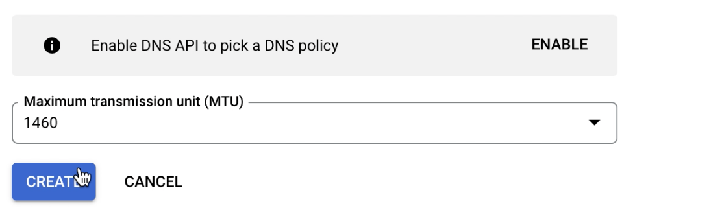

6. Repeat Step 1-5 to create vpc for `Python Webapp` and `Database`. For `Python Webapp` use the following values
        * VPC name: `vpc-webapp`
        * Subnet name: `subnet-web-1`
        * Region: `us-east1`
        * IPv4 range: `10.1.0.0/16`

    For `Database` use the following values
        * VPC name: `vpc-db`
        * Subnet name: `subnet-db-1`
        * Region: `us-east1`
        * IPv4 range: `10.2.0.0/16`

### Create VPC Peering

To comminucate with the instances in different VPCs, a connection is needed. In this case we'll use VPC peering. To create VPC peering we need to create peering from both VPC. Like to create peering between `vpc-nginx-lb` and `vpc-webapp` we need to create 2 conections, one from `vpc-nginx-lb` to `vpc-webapp` and one from `vpc-webapp` to `vpc-nginx-lb`. Same will repeat for `vpc-nginx-lb` and `vpc-db`. The steps are below

1. Go to `VPC network > VPC Networking peering` 

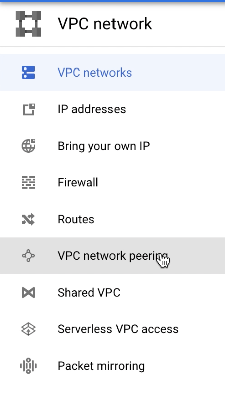

2. Then click `CREATE CONNECTION` 

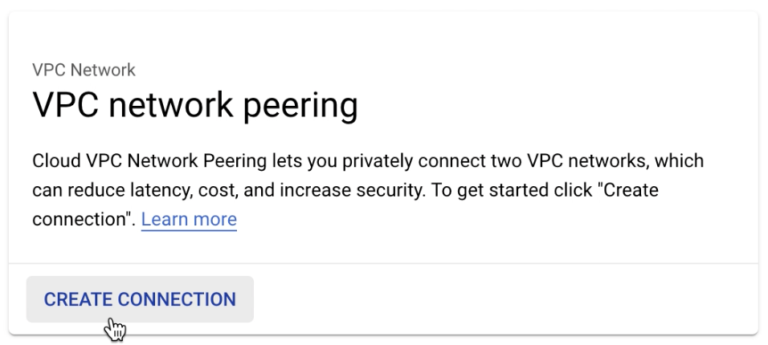

3. Enter a name like `vpc-peer-lb-app` to create a connection from `vpc-nginx-lb` to `vpc-webapp`. In `Your VPC network` pick `vpc-nginx-lb` and in `Peered VPC Network` section pick in this project and in `VPC network name` pick `vpc-webapp` and click `CREATE` to create a connection from `vpc-nginx-lb` to `vpc-webapp`. 

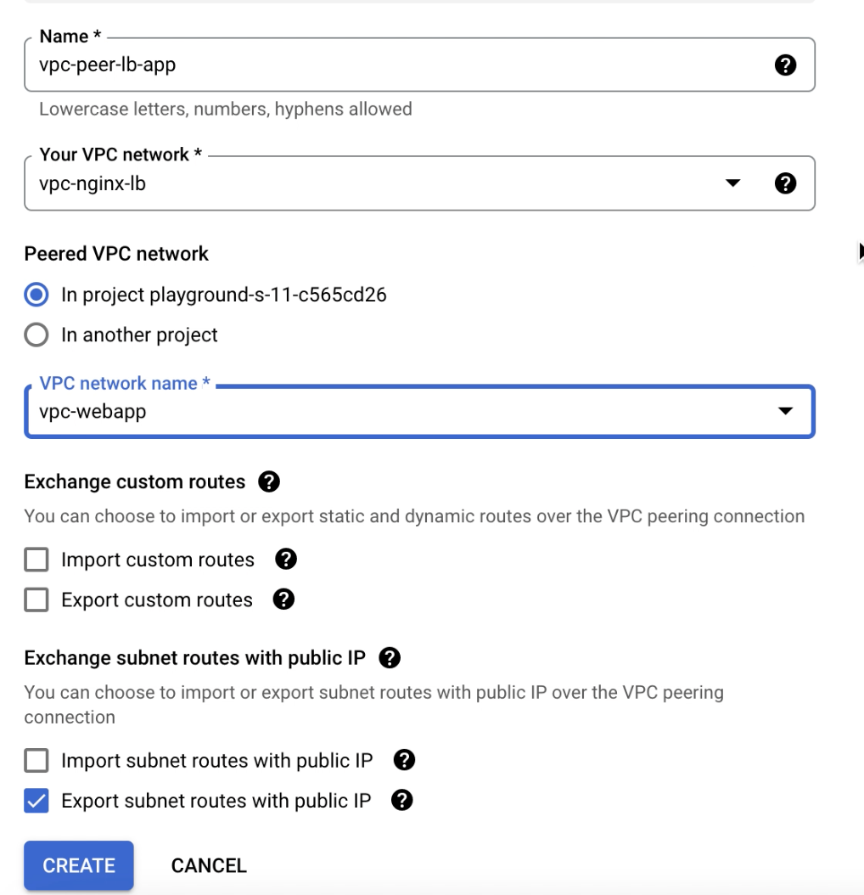

4. Now create a connection from `vpc-webapp` to `vpc-nginx-lb` and name it `vpc-peer-webapp-lb`. Click `CREATE` to create the connection. 

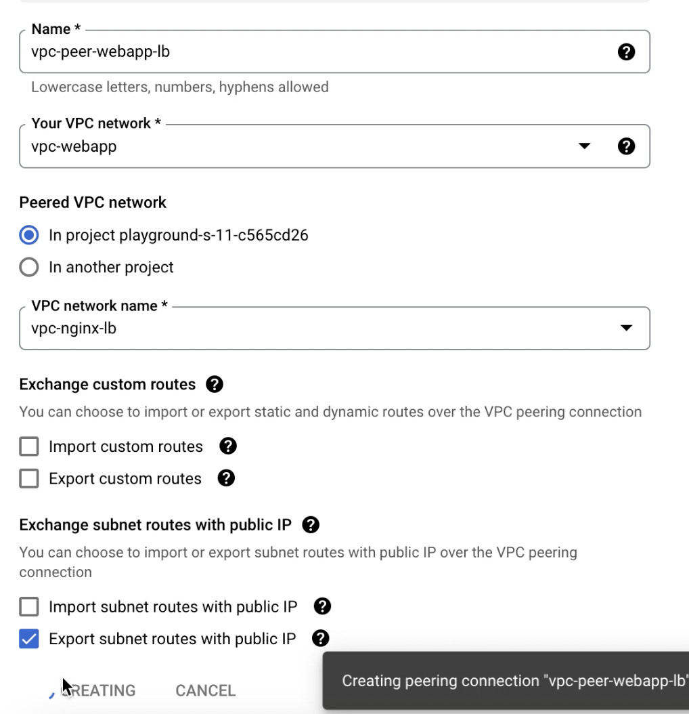

5. Repeat Step 1-4 for `vpc-nginx-lb` and `vpc-db`. Give suitable names to recognize correctly which network does what.

6. The list will have at least 4 entries after this 

### Create 1 vm instance in each vpc

Now we'll need to create 1 vm instance in each VPCs created earlier. We'll start with the load balancer instance

1. Go to `Compute engine` then `VM instances` from menu and click on `CREATE INSTANCE` button

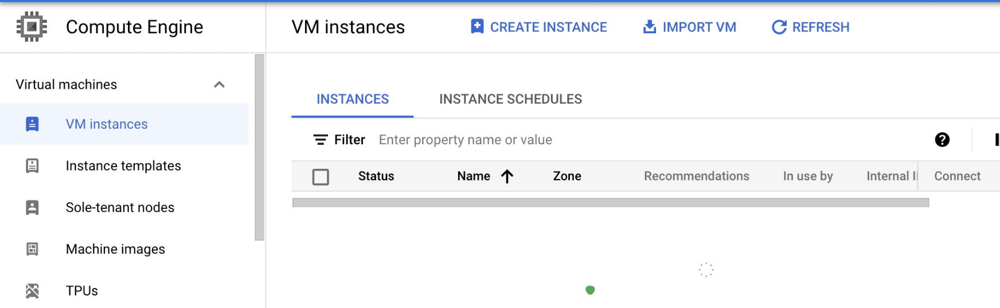

2. Give the instance a meaningful name, we'll call it `instance-nginx-lb`. Pick a region in which we've created the VPCs previously.

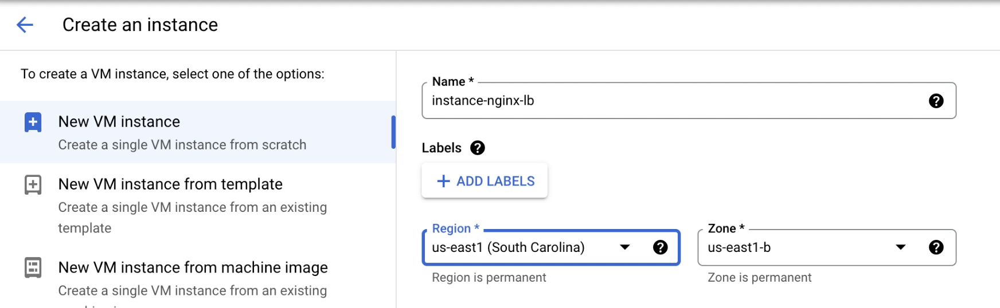

3. Now scroll down and expand `Advanced options` and `Networking`. In `Network interface` pick the desired VPC to create the instance in that VPC. In this case pick `vpc-nginx-lb`. The subnet will be automatically picked. 

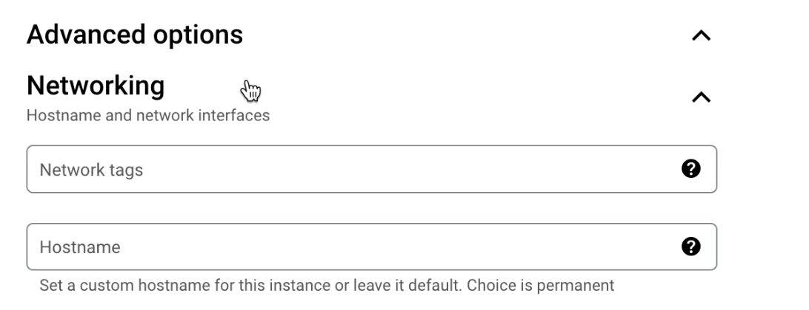
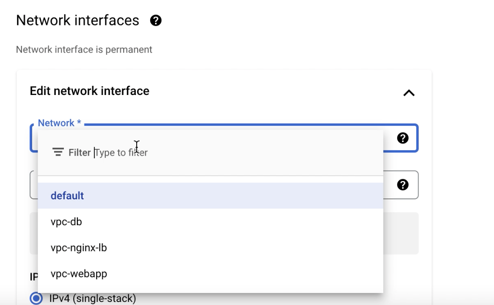
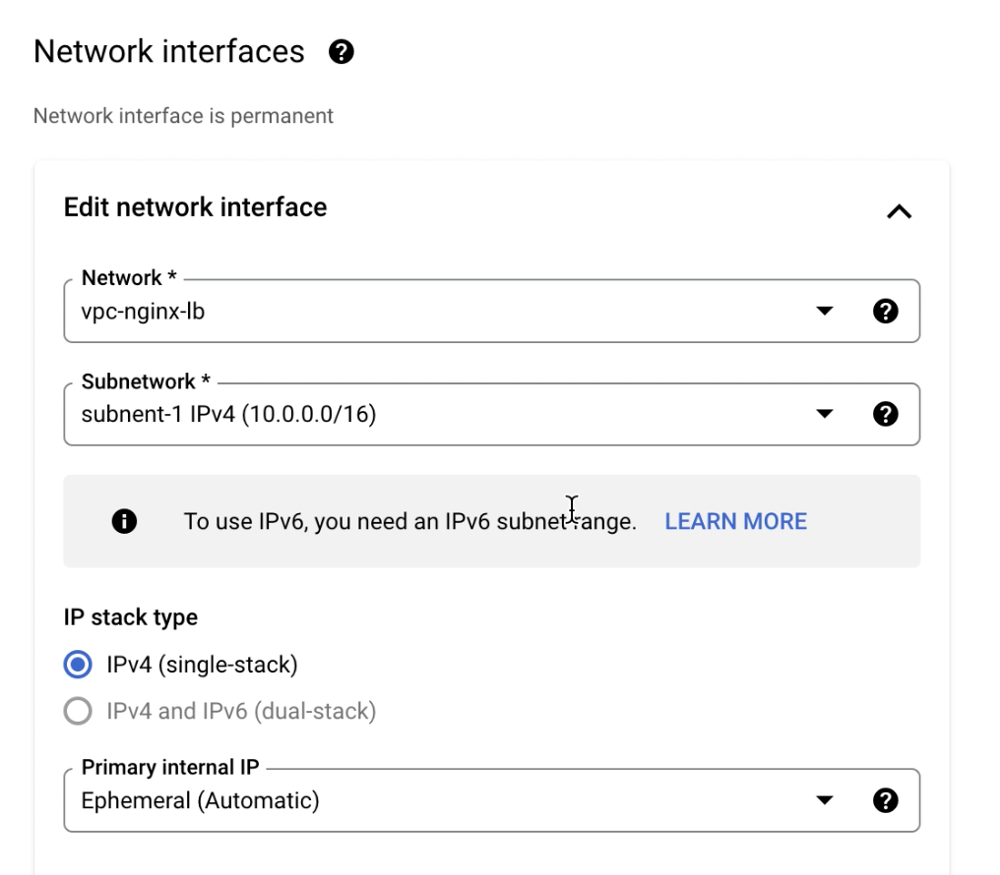

4. Finally click `CREATE` to create the instance

5. Repeat Step 1-4 to create other 2 instances for `webapp` and `database`. Remember to give a meaningfull name and pick correct networking settings. Like for `instance-webapp` pick `vpc-webapp` as network, and for `instance-mysql` pick `vpc-db` as network. Now create the instances. After this step we'll have 3 instances like the picture below. Note that all the `Internal IP`s are from ip range declared in VPC creation section.

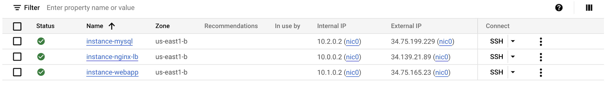

### Create firewall rules for each instance

We'll need to create firewall rules in order to allow the packets to pass. We'll need 4 rules to make the setup working

1. Allow `tcp` trafic on port `3306` on `vpc-db` from `vpc-nginx-lb` (10.0.0.0/16) ip range. 

2. Allow `tcp` trafic on port `3306` on `vpc-nginx-lb` from `vpc-webapp` (10.1.0.0/16) ip range. 

3. Allow `tcp` trafic on port `80` on `vpc-nginx-lb` from all ip range (0.0.0.0/0). 

4. Allow `tcp` trafic on port `3000` on `vpc-webapp` from `vpc-nginx-lb` (10.0.0.0/16) ip range.

To create #1 Go to `VPC network > Firewall` and click `CREATE FIREWALL RULE`.

 Give a name, as we are allowing connection on `vpc-db` from `vpc-nginx-lb` we can name it `allow-nginx-lb-db` like allow nginx load balancer to database. 

 Pick network `vpc-db`, in `Targets` dropdown pick `All instances in the network`. `Action on match` will be `Allow`. In `Source filter` pick `IPv4 ranges`. In `Source IPv4 ranges` input `10.0.0.0/16`.

 In `Protocols and ports` section check `TCP` and in ports give `3306` to allow trafic on that port and click `CREATE`. 
 
 As `mysql` runs on port `3306` we are allowing trafic from `vpc-nginx-lb` on port `3306` in `vpc-db`.

Now repeat the same steps to crete firewall rule for #2, #3, #4 with their corresponding configuration mentioned above. 

### Install necessary packages in each instance

Now ssh into all 3 instances and install few softwares in all of them. Run the following commands.

`sudo apt update`

`sudo apt install -y docker.io docker-compose telnet git nano`

Clone the repository in all of them

`git clone https://github.com/masudur-rahman-niloy/nginx-loadbalancing.git`

#### In mysql instance 

Go to folder `nginx-loadbalancing/mysql` by

`cd nginx-loadbalancing/mysql` and run

`sudo docker-compose up -d`

#### In webapp instance

Go to folder `nginx-loadbalancing/python-webserver` by

`cd nginx-loadbalancing/python-webserver` 

Change the `docker-compose.yml` file using `nano`

`nano docker-compose.yml`

Change the `MYSQL_HOST` environment variable to load balancer ip. In our case `10.0.0.2`. Save and exit using `CTRL + X`, press `y` in confirmation prompt.

It seems confusing, but we'll load balance the `mysql` instance in next step.

Now run to run webserver instances
`sudo docker-compose up -d`

#### In Nginx load balancer instance

Go to folder `nginx-loadbalancing/nginx-load-balancer` by

`cd nginx-loadbalancing/nginx-load-balancer` 

Update the `nginx.conf` file using nano

`nano nginx.conf`

Change `server` value in `upstream backend` to webapp ip address and port and `upstream db` to db ip address and port. 

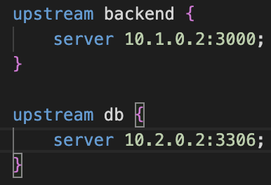

Save and exit using `CTRL +X`. Now run

`sudo docker-compose up -d` to start nginx service. 

The load balancer using nginx is configured to listen on port `80` and proxy pass to backend service on another instance on port `3000`. And port `3306` is proxy passed to `mysql` instance's `3306` port.

### Test the setup

To check the connectivity we can use `telnet` command.

From load balancer instance check connection to webapp and database by typing

To check webapp connection `telnet 10.1.0.2 3000`
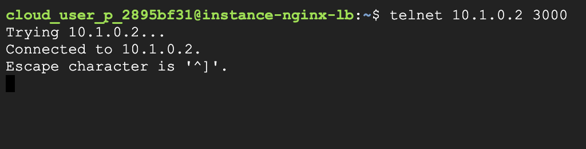

To check database connection `telnet 10.2.0.2 3306`

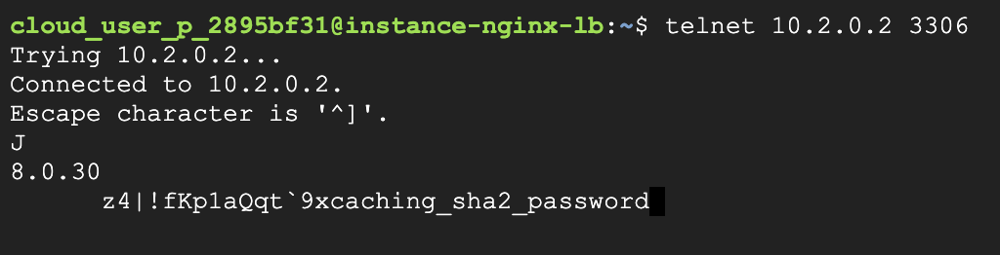

If everything is ok then we should see the above outputs.

We need to check another connection from webapp instance

To check database connection `telnet 10.0.0.2 3306`

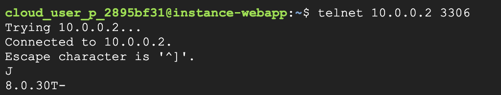

Now we can check connection from browser 

Visiting public ip of `instance-nginx-lb` will show 

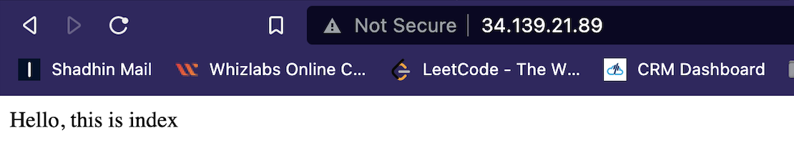

Visiting `/connection` path will show 

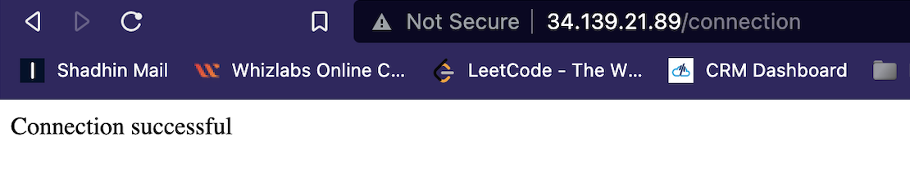

